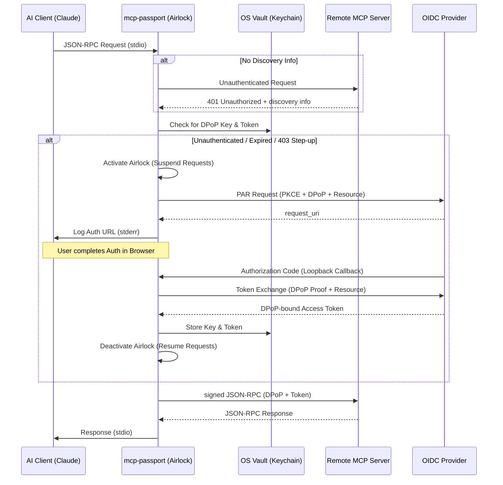

# mcp-passport 🛡️


**Secure 1:1 transparent Layer 7 proxy for the Model Context Protocol (MCP)**

`mcp-passport` is a high-performance, secure bridge designed to protect remote MCP servers using industry-standard **FAPI 2.0** (Financial-grade API) security. It acts as a local `stdio` server for AI clients (like Claude Desktop or Gemini CLI) and proxies requests to a remote MCP server over HTTPS, handling complex authentication and discovery flows transparently.

## ✨ Key Features

- **MCP Compliance (Spec 2025-11-25)**: Full implementation of the MCP Authorization specification, including dynamic discovery and resource signaling.
- **Dynamic Discovery**: Automatically locates the authorization server via `WWW-Authenticate` headers in 401 challenges or the `/.well-known/oauth-protected-resource` fallback.
- **FAPI 2.0 Security**: Financial-grade security patterns including **Pushed Authorization Requests (PAR)** and **PKCE**.
- **DPoP (Demonstrating Proof-of-Possession)**: Cryptographically binds access tokens to ephemeral ES256 keys, preventing token replay attacks.
- **"Airlock" Mechanism**: Automatically suspends JSON-RPC requests to trigger OIDC flows, supporting 401 expiration and **403 Step-up** (insufficient scope) challenges.
- **RFC 8707 Resource Indicators**: Explicitly identifies target MCP servers in OIDC requests to prevent token misuse across different resources.
- **Secure OS Vault Integration**: Leverages the system's native secure storage (macOS Keychain, Windows Credential Manager, Linux Secret Service) via `keyring`.
- **SSE Support**: Handles persistent Server-Sent Events (SSE) from the remote server, piping them back to the AI client.

## 🏗️ Architecture: The Bridge



## 🚀 Getting Started

### Installation

Build the binary from source:

```bash
cargo build --release
```

The compiled binary will be located at `target/release/mcp-passport`.

### Claude Desktop Integration

To use `mcp-passport` with Claude Desktop, add it to your `claude_desktop_config.json`:

**macOS**: `~/Library/Application Support/Claude/claude_desktop_config.json`  
**Windows**: `%APPDATA%\Claude\claude_desktop_config.json`

```json
{
  "mcpServers": {
    "my-secure-server": {
      "command": "/path/to/mcp-passport",
      "args": [
        "--remote-mcp-url", "https://your-mcp-server.com/rpc",
        "--remote-sse-url", "https://your-mcp-server.com/sse",
        "--oidc-client-id", "your-client-id"
      ],
      "env": {
        "RUST_LOG": "info"
      }
    }
  }
}
```

When Claude starts the server, `mcp-passport` will output an authentication URL to `stderr`. You'll need to open this URL in your browser to complete the OIDC login. Once authenticated, tokens are securely stored in your OS keychain and used automatically for future sessions.

## ⚙️ Configuration

`mcp-passport` can be configured via CLI flags or environment variables.

| Option | CLI Flag | Environment Variable | Default |
|--------|----------|----------------------|---------|
| Remote MCP URL | `--remote-mcp-url` | `MCP_PASSPORT_REMOTE_MCP_URL` | **Required** |
| Remote SSE URL | `--remote-sse-url` | `MCP_PASSPORT_REMOTE_SSE_URL` | **Required** |
| Auth Scheme | `--auth-scheme` | `MCP_PASSPORT_AUTH_SCHEME` | `bearer` |
| Protocol Version | `--mcp-protocol-version` | `MCP_PASSPORT_MCP_PROTOCOL_VERSION` | `2025-11-25` |
| Discovery URL | `--oidc-discovery-url` | `MCP_PASSPORT_OIDC_DISCOVERY_URL` | Optional (Lazy) |
| Client ID | `--oidc-client-id` | `MCP_PASSPORT_OIDC_CLIENT_ID` | `mcp-passport` |
| Redirect URL | `--oidc-redirect-url`| `MCP_PASSPORT_OIDC_REDIRECT_URL` | `http://127.0.0.1:8082/callback` |
| User ID | `--user-id` | `MCP_PASSPORT_USER_ID` | `default_user` |

> **Note on Auth Scheme**: The MCP spec requires `Authorization: Bearer <token>`. `mcp-passport` uses this by default while still sending the `DPoP` proof header for FAPI 2.0 security. Use `dpop` scheme only if the remote server explicitly requires it.

## 🛠️ Development & Testing

### Running Tests
The project includes a comprehensive test suite, including headless browser automation for full E2E compliance verification.

```bash
# Run standard tests
cargo test

# Run headless browser E2E compliance test
# (Requires Docker for Selenium/Chrome)
cargo test --test headless_compliance_test -- --nocapture
```

### Headless Browser Testing
The `headless_compliance_test` uses **Fantoccini** and **Selenium Standalone Chrome** (via Testcontainers) to automate the full OIDC flow:
1. Triggers 401 discovery.
2. Automates a browser session to perform the PAR-based login.
3. Verifies the final authorized MCP request.

## 📄 License

This project is licensed under the MIT License - see the [LICENSE](LICENSE) file for details.
