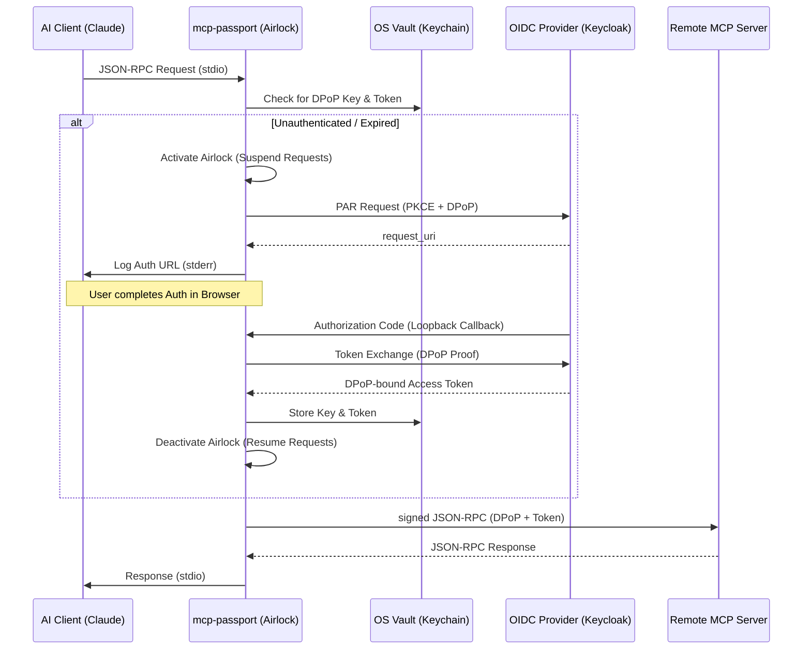

# mcp-passport 🛡️


**Secure 1:1 transparent Layer 7 proxy for the Model Context Protocol (MCP)**

`mcp-passport` is a high-performance, secure bridge designed to protect remote MCP servers using industry-standard **FAPI 2.0** (Financial-grade API) security. It acts as a local `stdio` server for AI clients (like Claude Desktop) and proxies requests to a remote MCP server over HTTPS, handling complex authentication flows transparently.

## ✨ Key Features

- **FAPI 2.0 Compliant**: Implements state-of-the-art security patterns including **Pushed Authorization Requests (PAR)** and **PKCE**.
- **DPoP (Demonstrating Proof-of-Possession)**: Cryptographically binds access tokens to ephemeral ES256 keys, preventing token replay attacks even if a token is leaked.
- **"Airlock" Mechanism**: Automatically suspends JSON-RPC requests to trigger OIDC flows when tokens are missing or expired, resuming them seamlessly after authentication.
- **Secure OS Vault Integration**: Leverages the system's native secure storage (macOS Keychain, Windows Credential Manager, Linux Secret Service) via `keyring` for sensitive token and key storage.
- **SSE Support**: Handles persistent Server-Sent Events (SSE) from the remote server, piping them back to the AI client's `stdio`.
- **Transparent Proxying**: Maintains 1:1 JSON-RPC transparency without logging or modifying payloads.

## 🏗️ Architecture: The "Airlock"



## 🚀 Getting Started

### Prerequisites

- [Rust toolchain](https://rustup.rs/) (latest stable)
- A running OIDC provider (e.g., [Keycloak](https://www.keycloak.org/)) configured for FAPI 2.0.

### Installation

Build the binary from source:

```bash
cargo build --release
```

The compiled binary will be located at `target/release/mcp-passport`.

## ⚙️ Configuration

`mcp-passport` can be configured via CLI flags or environment variables.

| Option | CLI Flag | Environment Variable | Default |
|--------|----------|----------------------|---------|
| Remote MCP URL | `--remote-mcp-url` | `MCP_PASSPORT_REMOTE_MCP_URL` | **Required** |
| Remote SSE URL | `--remote-sse-url` | `MCP_PASSPORT_REMOTE_SSE_URL` | **Required** |
| Discovery URL | `--oidc-discovery-url` | `MCP_PASSPORT_OIDC_DISCOVERY_URL` | Optional |
| Auth URL | `--kc-auth-url` | `MCP_PASSPORT_KC_AUTH_URL` | Optional (Required if no Discovery) |
| Token URL | `--kc-token-url` | `MCP_PASSPORT_KC_TOKEN_URL` | Optional (Required if no Discovery) |
| PAR URL | `--kc-par-url` | `MCP_PASSPORT_KC_PAR_URL` | Optional (Required if no Discovery) |
| Client ID | `--oidc-client-id` | `MCP_PASSPORT_OIDC_CLIENT_ID` | `mcp-passport` |
| Redirect URL | `--oidc-redirect-url`| `MCP_PASSPORT_OIDC_REDIRECT_URL` | `http://127.0.0.1:8082/callback` |
| User ID | `--user-id` | `MCP_PASSPORT_USER_ID` | `default_user` |

## 🤖 AI Client Integration

### Claude Desktop

Add the following to your `claude_desktop_config.json`:

```json
{
  "mcpServers": {
    "secure-proxy": {
      "command": "/absolute/path/to/mcp-passport",
      "args": [],
      "env": {
        "MCP_PASSPORT_REMOTE_MCP_URL": "https://mcp.your-domain.com/rpc",
        "MCP_PASSPORT_REMOTE_SSE_URL": "https://mcp.your-domain.com/sse",
        "MCP_PASSPORT_OIDC_DISCOVERY_URL": "https://auth.your-domain.com/realms/your-realm/.well-known/openid-configuration"
      }
    }
  }
}
```

### Gemini CLI

Add the following to your `settings.json` (located at `~/.gemini/settings.json` or in your project's `.gemini/settings.json`):

```json
{
  "mcpServers": {
    "secure-proxy": {
      "command": "/absolute/path/to/mcp-passport",
      "args": [],
      "env": {
        "MCP_PASSPORT_REMOTE_MCP_URL": "https://mcp.your-domain.com/rpc",
        "MCP_PASSPORT_REMOTE_SSE_URL": "https://mcp.your-domain.com/sse",
        "MCP_PASSPORT_OIDC_DISCOVERY_URL": "https://auth.your-domain.com/realms/your-realm/.well-known/openid-configuration"
      },
      "trust": true
    }
  }
}
```

A complete example targeting local Docker services can be found in [example/settings.json](example/settings.json).

## 🛠️ Development & Testing

### Running Tests
The project includes a comprehensive test suite including unit tests and integration tests with mocked OIDC providers and live Keycloak instances.

```bash
# Run all tests
cargo test -- --nocapture

# Run clippy for linting
cargo clippy -- -D warnings
```

### Code Coverage
To check code coverage, we recommend using `cargo-tarpaulin`:

```bash
# Install tarpaulin
cargo install cargo-tarpaulin

# Run coverage report
cargo tarpaulin --ignore-config --ignore-tests -v
```

## 📄 License

This project is licensed under the MIT License - see the [LICENSE](LICENSE) file for details.
