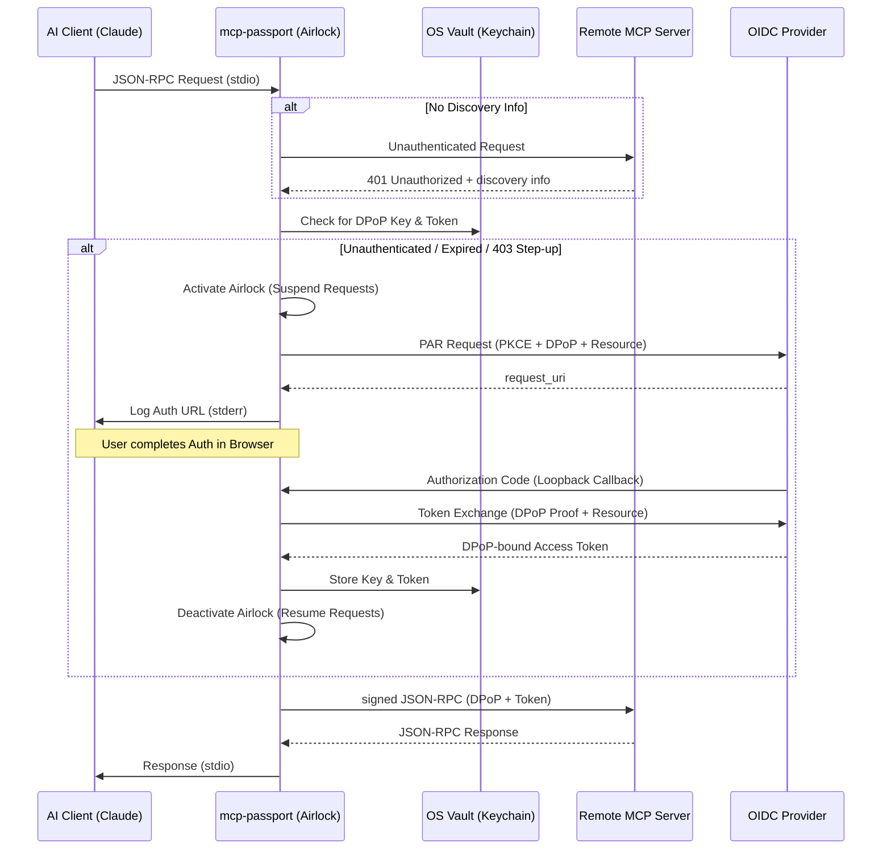

# mcp-passport 🛡️


[](https://codecov.io/gh/ffalcinelli/mcp-passport)


**Secure 1:1 transparent Layer 7 proxy for the Model Context Protocol (MCP)**

`mcp-passport` is a high-performance, secure bridge designed to protect remote MCP servers using industry-standard **FAPI 2.0** (Financial-grade API) security. It acts as a local `stdio` server for AI clients (like Claude Desktop or Gemini CLI) and proxies requests to a remote MCP server over HTTPS, handling complex authentication and discovery flows transparently.

## ✨ Key Features

- **MCP Compliance (Spec 2025-11-25)**: Full implementation of the MCP Authorization specification, including dynamic discovery and resource signaling.
- **Dynamic Discovery**: Locates the authorization server the way the MCP spec describes: RFC 9728 Protected Resource Metadata (from the `resource_metadata` of a 401 challenge, or the `/.well-known/oauth-protected-resource` URIs), then RFC 8414 / OpenID Connect metadata of the listed authorization server, with `issuer` validation.
- **Streamable HTTP**: Handles JSON and `text/event-stream` responses to POSTs, `202 Accepted`, session ids (including expiry) and a resumable GET event stream.
- **FAPI 2.0 Security**: Financial-grade security patterns including **Pushed Authorization Requests (PAR)** and **PKCE**.
- **DPoP (Demonstrating Proof-of-Possession)**: Cryptographically binds access tokens to ephemeral ES256 keys, preventing token replay attacks.
- **"Airlock" Mechanism**: Automatically suspends JSON-RPC requests to trigger OIDC flows, supporting 401 expiration and **403 Step-up** (insufficient scope) challenges. Concurrent requests share a single login.
- **Silent Refresh**: Expired tokens are renewed with the DPoP-bound refresh token, so the browser only opens when a new login is really needed.
- **DPoP Nonces**: Server-provided nonces (RFC 9449 §8/§9) from both the authorization server and the MCP server are handled transparently.
- **RFC 8707 Resource Indicators**: Explicitly identifies target MCP servers in OIDC requests to prevent token misuse across different resources.
- **Secure OS Vault Integration**: Leverages the system's native secure storage (macOS Keychain, Windows Credential Manager, Linux Secret Service) via `keyring`.
- **SSE Support**: Handles persistent Server-Sent Events (SSE) from the remote server, piping them back to the AI client.

## 🏗️ Architecture: The Bridge


```mermaid
sequenceDiagram
    participant C as AI Client (Claude)
    participant P as mcp-passport (Airlock)
    participant V as OS Vault (Keychain)
    participant S as Remote MCP Server
    participant O as OIDC Provider

    C->>P: JSON-RPC Request (stdio)
    alt No Discovery Info
        P->>S: Unauthenticated Request
        S-->>P: 401 Unauthorized + discovery info
    end
    P->>V: Check for DPoP Key & Token
    alt Unauthenticated / Expired / 403 Step-up
        P->>P: Activate Airlock (Suspend Requests)
        P->>O: PAR Request (PKCE + DPoP + Resource)
        O-->>P: request_uri
        P->>C: Log Auth URL (stderr)
        Note over C,P: User completes Auth in Browser
        O->>P: Authorization Code (Loopback Callback)
        P->>O: Token Exchange (DPoP Proof + Resource)
        O-->>P: DPoP-bound Access Token
        P->>V: Store Key & Token
        P->>P: Deactivate Airlock (Resume Requests)
    end
    P->>S: signed JSON-RPC (DPoP + Token)
    S-->>P: JSON-RPC Response
    P->>C: Response (stdio)
```

## 🚀 Getting Started

### Installation

Build the binary from source:

```bash
cargo build --release
```

The compiled binary will be located at `target/release/mcp-passport`.

### Claude Desktop Integration

To use `mcp-passport` with Claude Desktop, add it to your `claude_desktop_config.json`:

**macOS**: `~/Library/Application Support/Claude/claude_desktop_config.json`  
**Windows**: `%APPDATA%\Claude\claude_desktop_config.json`

```json
{
  "mcpServers": {
    "my-secure-server": {
      "command": "/path/to/mcp-passport",
      "args": [
        "--remote-mcp-url", "https://your-mcp-server.com/mcp",
        "--oidc-client-id", "your-client-id"
      ],
      "env": {
        "RUST_LOG": "info"
      }
    }
  }
}
```

When Claude starts the server, `mcp-passport` will output an authentication URL to `stderr` (and try to open it in your browser). Complete the OIDC login there. Once authenticated, tokens are securely stored in your OS keychain, one entry per MCP server, and used automatically for future sessions.

If anything fails along the way (network, HTTP error, login), the client receives a JSON-RPC error for its request instead of waiting forever.

## ⚙️ Configuration

`mcp-passport` can be configured via CLI flags or environment variables.

| Option | CLI Flag | Environment Variable | Default |
|--------|----------|----------------------|---------|
| Remote MCP URL | `--remote-mcp-url` | `MCP_PASSPORT_REMOTE_MCP_URL` | **Required** |
| Remote SSE URL | `--remote-sse-url` | `MCP_PASSPORT_REMOTE_SSE_URL` | Same as the MCP URL (Streamable HTTP) |
| Auth Scheme | `--auth-scheme` | `MCP_PASSPORT_AUTH_SCHEME` | `bearer` |
| Protocol Version | `--mcp-protocol-version` | `MCP_PASSPORT_MCP_PROTOCOL_VERSION` | `2025-11-25` |
| Discovery URL | `--oidc-discovery-url` | `MCP_PASSPORT_OIDC_DISCOVERY_URL` | Optional (dynamic discovery) |
| AS endpoint overrides | `--kc-auth-url`, `--kc-token-url`, `--kc-par-url` | `MCP_PASSPORT_KC_AUTH_URL`, ... | Optional |
| Client ID | `--oidc-client-id` | `MCP_PASSPORT_OIDC_CLIENT_ID` | `mcp-passport` |
| Redirect URL | `--oidc-redirect-url`| `MCP_PASSPORT_OIDC_REDIRECT_URL` | `http://127.0.0.1:8082/callback` |
| User ID | `--user-id` | `MCP_PASSPORT_USER_ID` | `default_user` |
| Login timeout | `--auth-timeout-secs` | `MCP_PASSPORT_AUTH_TIMEOUT_SECS` | `300` |
| Allow plain HTTP | `--allow-insecure-http` | `MCP_PASSPORT_ALLOW_INSECURE_HTTP` | off |
| Log directory | `--log-dir` | `MCP_PASSPORT_LOG_DIR` | per-user state dir (e.g. `~/.local/state/mcp-passport/logs`) |

**Where the authorization server comes from**, in order of precedence:
1. The `--kc-*-url` endpoint overrides (when all three are set).
2. `--oidc-discovery-url`, fetched as is.
3. Dynamic discovery from the MCP server (RFC 9728, then RFC 8414 / OIDC Discovery).

> **Note on Auth Scheme**: The MCP spec requires `Authorization: Bearer <token>`. `mcp-passport` uses this by default while still sending the `DPoP` proof header for FAPI 2.0 security. Use `dpop` scheme only if the remote server explicitly requires it.

## 🛡️ Security Considerations

### Transport and Credential Isolation
- The MCP server, discovery URL and authorization server endpoints must use **HTTPS**. Plain HTTP is accepted only for loopback hosts, unless you pass `--allow-insecure-http`.
- The redirect URL must be a loopback `http` URL with a port (RFC 8252 §7.3), so the callback server is never reachable from the network.
- Tokens are stored per MCP server (keychain service `mcp-passport:<hash of the server URL>`), so a token issued for one server is never sent to another.
- A `resource_metadata` URL in a challenge is only followed if it has the same origin (scheme, host, port) as the MCP server.
- The authorization response is checked for `state` and, when the server supports it, `iss` (RFC 9207).

### Logs
Logs go to stderr and to `mcp-passport.log` in the log directory. The directory is created with mode `0700`; an existing directory that is a symlink, or that the current user does not own, is refused.

### Local Machine Trust
The proxy communicates with the AI Client via local `stdio`. The security model assumes the local machine is safe. If a user's machine is compromised, local malware could bypass the network authentication by simply hijacking the `stdio` pipeline or querying the OS Vault while unlocked.

## 🛠️ Development & Testing

### Running Tests
The project includes a comprehensive test suite, including headless browser automation for full E2E compliance verification.

```bash
# Run standard tests
cargo test

# Run headless browser E2E compliance test
# (Requires Docker for Selenium/Chrome)
cargo test --test headless_compliance_test -- --nocapture
```

### Headless Browser Testing
The `headless_compliance_test` uses **Fantoccini** and **Selenium Standalone Chrome** (via Testcontainers) to automate the full OIDC flow:
1. Triggers 401 discovery.
2. Automates a browser session to perform the PAR-based login.
3. Verifies the final authorized MCP request.

## 📄 License

This project is licensed under the MIT License - see the [LICENSE](LICENSE) file for details.
