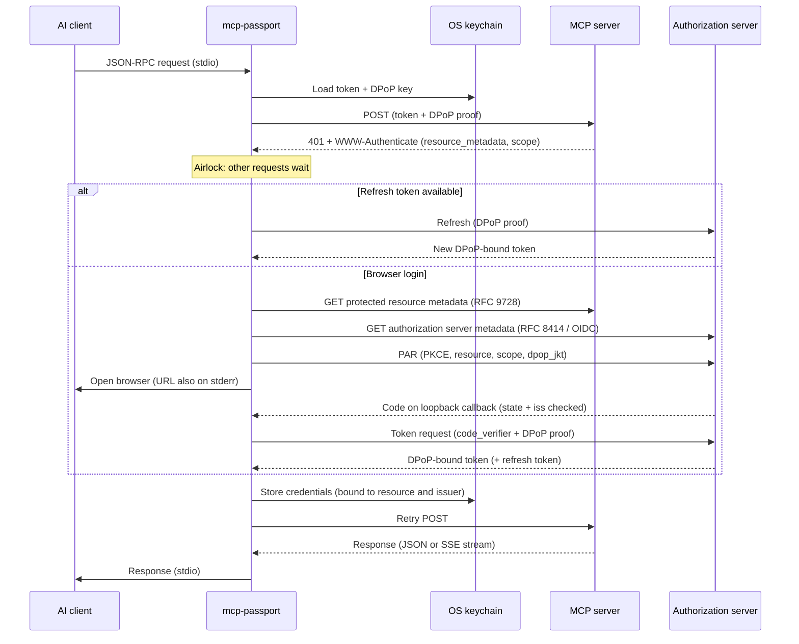

# mcp-passport

[](https://github.com/ffalcinelli/mcp-passport/actions/workflows/ci.yml)
[](https://codecov.io/gh/ffalcinelli/mcp-passport)
[](https://ffalcinelli.github.io/mcp-passport/)
[](LICENSE)
[](Cargo.toml)

**A local stdio bridge that connects AI clients to OAuth-protected remote MCP servers, with FAPI 2.0 security: PAR, PKCE and DPoP-bound tokens.**

Your AI client (Claude Desktop, Claude Code, Gemini CLI, …) launches `mcp-passport` like any local MCP server. `mcp-passport` forwards every message to the remote server over HTTPS. When the server asks for credentials, it discovers the authorization server, logs you in through your browser, and keeps the tokens in your OS keychain, without the client knowing anything about OAuth.

📖 **[Website & API docs](https://ffalcinelli.github.io/mcp-passport/)** · [Setup guide](GUIDE.md) · [Development](DEVELOPMENT.md) · [Changelog](CHANGELOG.md) · [Security](SECURITY.md)

## Why

Remote MCP servers protect their tools with OAuth, but many clients only speak stdio, and even OAuth-capable clients rarely do sender-constrained tokens. `mcp-passport` closes that gap:

- **No bearer tokens to steal.** Access tokens are bound to a per-login P-256 key (DPoP). A leaked token is useless without the key, which never leaves your machine.
- **Spec-compliant discovery.** Point it at an MCP server URL and nothing else. The authorization server is found through the server's protected resource metadata.
- **Invisible re-authentication.** Expired tokens are refreshed silently. When a login is really needed, requests wait in the "airlock" until you finish it in the browser, then resume.

## Quick start

### 1. Install

Download a binary for your platform from the [releases page](https://github.com/ffalcinelli/mcp-passport/releases) (`.tar.gz` for Linux and macOS, `.zip` for Windows), or build from source with Rust 1.88+:

```bash
cargo install --git https://github.com/ffalcinelli/mcp-passport
# or
git clone https://github.com/ffalcinelli/mcp-passport && cd mcp-passport
cargo build --release   # → target/release/mcp-passport
```

### 2. Register the client

At your authorization server, create a **public** client (for example `mcp-passport`) with PAR, PKCE S256 and DPoP enabled, and the redirect URI `http://127.0.0.1:8082/callback`. See the [Keycloak notes](#keycloak) below, or [GUIDE.md](GUIDE.md#client-registration) for Client ID Metadata Documents.

### 3. Add it to your AI client

**Claude Desktop** (`claude_desktop_config.json`):

```json
{
  "mcpServers": {
    "my-secure-server": {
      "command": "/path/to/mcp-passport",
      "args": [
        "--remote-mcp-url", "https://mcp.example.com/mcp",
        "--oidc-client-id", "mcp-passport"
      ]
    }
  }
}
```

**Claude Code**:

```bash
claude mcp add my-secure-server -- /path/to/mcp-passport \
  --remote-mcp-url https://mcp.example.com/mcp --oidc-client-id mcp-passport
```

**Gemini CLI** (`settings.json`):

```json
{
  "mcpServers": {
    "my-secure-server": {
      "command": "/path/to/mcp-passport",
      "env": {
        "MCP_PASSPORT_REMOTE_MCP_URL": "https://mcp.example.com/mcp",
        "MCP_PASSPORT_OIDC_CLIENT_ID": "mcp-passport"
      }
    }
  }
}
```

On the first request your browser opens the login page; the URL is also printed to stderr. After you log in, the request completes and later sessions reuse the stored credentials.

## How it works


```mermaid
sequenceDiagram
    participant C as AI client
    participant P as mcp-passport
    participant K as OS keychain
    participant S as MCP server
    participant A as Authorization server

    C->>P: JSON-RPC request (stdio)
    P->>K: Load token + DPoP key
    P->>S: POST (token + DPoP proof)
    S-->>P: 401 + WWW-Authenticate (resource_metadata, scope)
    Note over P: Airlock: other requests wait
    alt Refresh token available
        P->>A: Refresh (DPoP proof)
        A-->>P: New DPoP-bound token
    else Browser login
        P->>S: GET protected resource metadata (RFC 9728)
        P->>A: GET authorization server metadata (RFC 8414 / OIDC)
        P->>A: PAR (PKCE, resource, scope, dpop_jkt)
        P->>C: Open browser (URL also on stderr)
        A-->>P: Code on loopback callback (state + iss checked)
        P->>A: Token request (code_verifier + DPoP proof)
        A-->>P: DPoP-bound token (+ refresh token)
    end
    P->>K: Store credentials (bound to resource and issuer)
    P->>S: Retry POST
    S-->>P: Response (JSON or SSE stream)
    P->>C: Response (stdio)
```

## Features

**MCP compatibility**
- **Dual-era**: forwards both [MCP 2026-07-28](https://modelcontextprotocol.io/specification/2026-07-28) clients (per-request `_meta`) and legacy clients (`initialize` sessions, up to 2025-11-25). Each message is sent with the rules of its era.
- **Streamable HTTP**:
  - JSON and `text/event-stream` responses, `202 Accepted`;
  - the `MCP-Protocol-Version`, `Mcp-Method` and `Mcp-Name` headers;
  - `x-mcp-header` tool parameters mirrored into `Mcp-Param-*` headers, with invalid tool definitions filtered from `tools/list`;
  - long-lived `subscriptions/listen` streams.
- **Cancellation**: a stdio `notifications/cancelled` closes the request's HTTP stream, which is how Streamable HTTP cancels.
- **Never hangs the client**: transport errors, HTTP errors and failed logins come back as JSON-RPC errors for the request.

**OAuth / FAPI 2.0**
- Discovery: RFC 9728 protected resource metadata, then RFC 8414 / OpenID Connect discovery, with exact `issuer` checks.
- Pushed Authorization Requests (RFC 9126), PKCE S256 (refused if the server doesn't support it), and RFC 8707 resource indicators.
- DPoP (RFC 9449): ES256 proofs with `ath`, server nonces, and `dpop_jkt` in PAR.
- Login response checks: `state`, RFC 9207 `iss`, and immediate failure on `error=`.
- Scope selection from the challenge, then `scopes_supported`. Step-up on `403 insufficient_scope` keeps earlier scopes.
- Silent refresh, also ahead of expiry. Concurrent requests share one login, and a token rejected right after login is reported as a loop instead of reopening the browser.

**Credential storage**
- macOS Keychain, Windows Credential Manager, Linux Secret Service (with a kernel-keyring cache).
- Credentials are scoped to the MCP server URL and bound to the issuer that granted them.

## Configuration

Every option is a CLI flag or an environment variable (`mcp-passport --help`).

| Flag | Environment variable | Default | Description |
|------|----------------------|---------|-------------|
| `--remote-mcp-url` | `MCP_PASSPORT_REMOTE_MCP_URL` | **required** | Remote MCP endpoint, e.g. `https://mcp.example.com/mcp` |
| `--oidc-client-id` | `MCP_PASSPORT_OIDC_CLIENT_ID` | `mcp-passport` | Pre-registered client ID, or the https URL of a Client ID Metadata Document |
| `--oidc-redirect-url` | `MCP_PASSPORT_OIDC_REDIRECT_URL` | `http://127.0.0.1:8082/callback` | Loopback callback (`http`, loopback host, explicit port) |
| `--oidc-issuer` | `MCP_PASSPORT_OIDC_ISSUER` | | Issuer your client ID is registered with; discovery must find exactly this one |
| `--oidc-discovery-url` | `MCP_PASSPORT_OIDC_DISCOVERY_URL` | | Authorization server metadata URL (skips discovery from the MCP server) |
| `--kc-auth-url`, `--kc-token-url`, `--kc-par-url` | `MCP_PASSPORT_KC_AUTH_URL`, `…_KC_TOKEN_URL`, `…_KC_PAR_URL` | | Endpoint overrides (no discovery when all three are set) |
| `--oidc-offline-access` | `MCP_PASSPORT_OIDC_OFFLINE_ACCESS` | off | Also request `offline_access` when the provider offers it |
| `--auth-scheme` | `MCP_PASSPORT_AUTH_SCHEME` | `bearer` | `Authorization` scheme (`bearer` or `dpop`); the DPoP proof is sent either way |
| `--auth-timeout-secs` | `MCP_PASSPORT_AUTH_TIMEOUT_SECS` | `300` | How long to wait for the browser login |
| `--remote-sse-url` | `MCP_PASSPORT_REMOTE_SSE_URL` | the MCP URL | Standalone SSE endpoint of legacy servers |
| `--mcp-protocol-version` | `MCP_PASSPORT_MCP_PROTOCOL_VERSION` | `2025-11-25` | Fallback `MCP-Protocol-Version` when a message doesn't determine it |
| `--allow-insecure-http` | `MCP_PASSPORT_ALLOW_INSECURE_HTTP` | off | Allow `http://` on non-loopback hosts (development only) |
| `--user-id` | `MCP_PASSPORT_USER_ID` | `default_user` | Name the credentials are stored under in the keychain |
| `--template-dir` | `MCP_PASSPORT_TEMPLATE_DIR` | | Custom `success.html` / `failure.html` for the login callback |
| `--log-level` | `MCP_PASSPORT_LOG_LEVEL` | `info` | `error`, `warn`, `info`, `debug` or `trace` (`RUST_LOG` also works) |
| `--log-dir` | `MCP_PASSPORT_LOG_DIR` | per-user state dir | Where `mcp-passport.log` is written |

The authorization server is chosen in this order: the three endpoint overrides, then `--oidc-discovery-url`, then dynamic discovery from the MCP server.

`MCP_PASSPORT_USE_MEMORY_VAULT=1` keeps credentials in memory only, for headless machines without a keychain. `MCP_PASSPORT_SKIP_OPEN_BROWSER=1` only prints the login URL.

## Keycloak

Tested with **Keycloak 26.8.0** (see [`keycloak-realm.json`](keycloak-realm.json) and the [setup guide](GUIDE.md#5-keycloak-tested-with-2680)):

- Public client with standard flow. Enable *Pushed authorization request required*, PKCE `S256` and *OAuth 2.0 DPoP Bound Access Tokens*.
- Keycloak ignores the RFC 8707 `resource` parameter and only lets the token's audience introspect it. If your MCP server validates tokens by introspection, add an **audience mapper** for the server's client.
- Define the scopes your server challenges for (e.g. `mcp:tools`, `mcp:admin`) as optional client scopes.
- Keycloak lists `offline_access` even for clients that may not use it, so `mcp-passport` only requests it with `--oidc-offline-access`.

## Security model

- Remote endpoints must use HTTPS (plain HTTP only on loopback, or with `--allow-insecure-http`). The login callback listens on loopback only.
- `resource_metadata` from a challenge is followed only on the MCP server's own origin.
- Tokens never go to a server other than the one they were issued for, and refresh tokens never go to a different authorization server.
- Logs go to a private (`0700`) per-user directory. Tokens, keys and codes are never logged; at `debug` level, MCP messages are.
- The local machine is trusted: anything that can drive the proxy's stdio or read your unlocked keychain can act as you.

See [SECURITY.md](SECURITY.md) for the threat model and how to report vulnerabilities.

## Troubleshooting

Logs are on stderr and in the log directory (the path is printed at startup); use `--log-level debug` for detail. [GUIDE.md](GUIDE.md#6-troubleshooting) explains the common errors: authentication loops, PKCE refusals, issuer mismatches, a missing Secret Service, port 8082 in use, and Keycloak introspection.

## Development

```bash
cargo test                                     # unit + integration suites (no Docker)
cargo test --test spec_2026_test               # MCP 2026-07-28 conformance, strict mock server
cargo test --test keycloak_2026_e2e_test -- --ignored --nocapture   # Keycloak 26.8.0 + Chrome (Docker)
cargo bench --bench crate                      # DPoP signing and vault hot paths
```

`docker compose up` starts Keycloak and a mock MCP server for manual testing. See [DEVELOPMENT.md](DEVELOPMENT.md) for the architecture and [CONTRIBUTING.md](CONTRIBUTING.md) for the workflow.

## License

[MIT](LICENSE)
